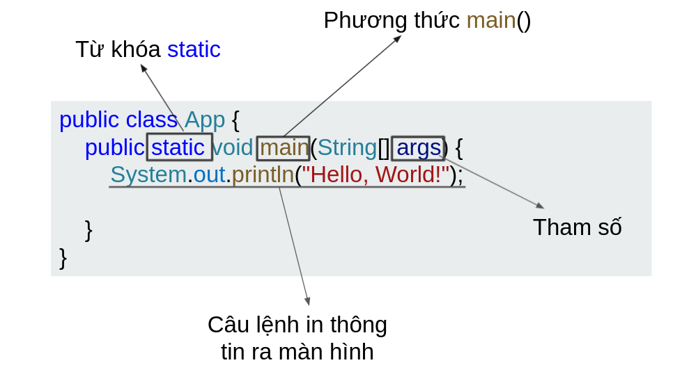

## Hướng dẫn tạo chương trình Java
### 1 - Sử dụng VSCode
Xem hướng dẫn dưới đây  
[https://youtu.be/adYYx1BBX2Q](https://youtu.be/adYYx1BBX2Q)

### 2- Sử dụng IntelliJ IDEA


## Cấu trúc của chương trình java

```java
package <package_name>;
import <other_package>;
public class <Class_name> {
    <Variables>;
    <Method>;
}
```
*Trong đó:*  
- `package`: Một package (gói) mô tả không gian tên có chứa các lớp của java, ta có thể xem package như một thư mục
- `import`: Nhằm sử dụng để xác định các class hoặc package được sử dụng trong lớp này
- `public`: Xác định phạm vi truy cập của lớp
- `class`: Từ khóa nhằm định nghĩa lớp của java
- `Variables`: Biến
- `Method`: Phương thức

*Ví dụ:*   
