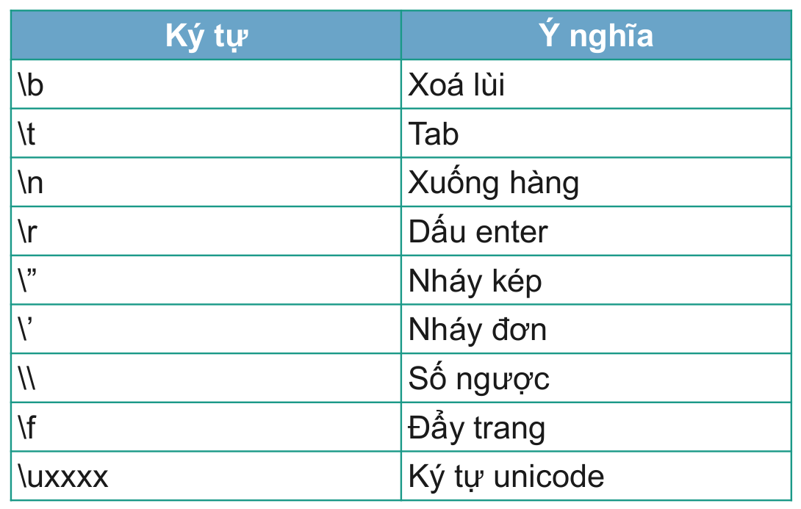

# Hằng số
Hằng là một giá trị không đổi trong suốt chương trình, tất nhiên
ta đã khởi tạo giá trị ngay từ ban đầu
Lý do sử dụng hằng:
- Tạo ra những giá trị không thay đổi , làm chương trình an
toàn hơn
- Sử dụng với các giá trị như PI, gia tốc trọng trường,...
- Sẽ cảnh báo nếu người dùng cố tình thay đổi giá trị sau này.
- Đảm bảo tính nguyên vẹn của giá trị

**Cú pháp tạo hằng số:**  
```java
<Phạm vi truy cập> static final <Kiểu dữ liệu> <Tên hằng> = <Giá trị>;
```

Ví dụ:  
```java
public static final double PI = 3.14;
```

*Lưu ý:* Tên của hằng luôn được viết in hoa  
</br>

**Một số hằng ký tự đặc biệt**    



</br>

# Enumerator
Enum là một kiểu dữ liệu đặc biệt được sử dụng để đại diện cho hằng số cố định.  
Một enum có thể chứa các thuộc tính, phương thức và constructor  
Bởi vì các giá trị của enum là hằng số nên tên của các trường kiểu enum thường là các chữ cái in hoa  

Ví dụ:
```java
enum Season{
    SPRING, SUMMER, AUTUMN, WINTER;
}

Season season = Season.WINTER;
System.out.println(season);
```