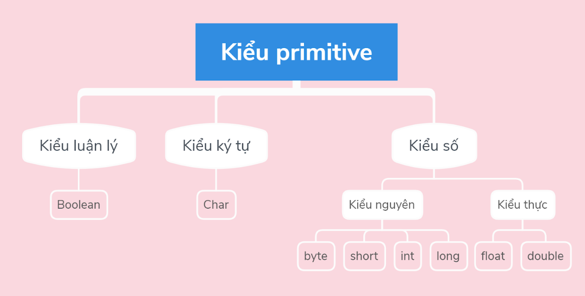
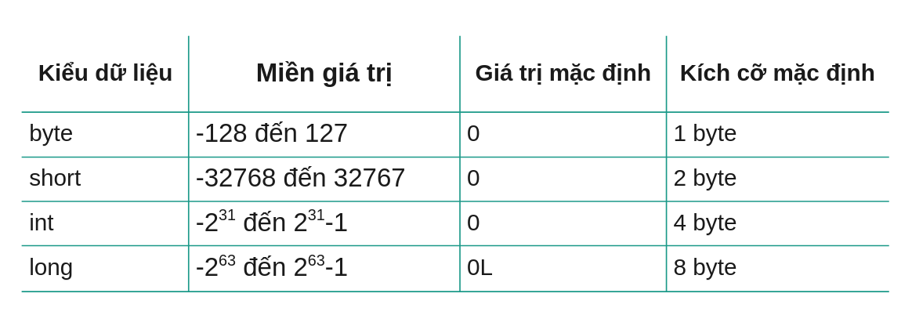

## Kiểu dữ liệu  
Vất cứ ngôn ngữ lập trình nào cũng đều có một tập kiểu dữ liệu, nó khá giống nhau với tất cả các ngôn ngữ.
Java có 2 loại kiểu dữ liệu: 
- Các kiểu dữ liệu nguyên thuỷ (Primitive Data Types)
- Các kiểu dữ liệu tham chiếu (Reference Types)

### Các kiểu dữ liệu nguyên thủy  

  
Kiểu dữ liệu nguyên thủy gồm 8 kiểu:  
**Các kiểu số nguyên: byte, short, int long**  

- Các kiểu số thực: float, double
- Kiểu ký tự: char
- Kiểu luận lý: boolean