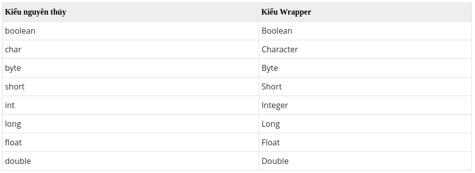

## ArrayList
ArrayList được sử dụng như mảng động để lưu trữ các phần tử.   
Những điểm cần ghi nhớ về ArrayList  
- Lớp ArrayList trong java có thể chứa các phần tử trùng lặp.
- Lớp ArrayList duy trì thứ tự của phần tử được thêm vào.
- Lớp ArrayList là không đồng bộ (non-synchronized).
- Lớp ArrayList cho phép truy cập ngẫu nhiên vì nó lưu dữ liệu theo chỉ mục.
- Lớp ArrayList trong java, thao tác chậm vì cần nhiều sự dịch chuyển nếu bất kỳ phần tử nào bị xoá khỏi danh sách.

## Khởi tạo ArrayList 
Cú pháp:  
`ArrayList<Kiểu dữ liệu> list = new ArrayList<>();`  
*Lưu ý:* Không thể sử dụng kiểu nguyên thủy với ArrayList

  


Ví dụ: 
```java
ArrayList<String> names = new ArrayList<>();
ArrayList<Integer> numbers = new ArrayList<>();
```

## Một số phương thức của lớp ArrayList

| Method | Description | 
|---|---|
| boolean add(Collection c) | Thêm phần tử được chỉ định vào cuối danh sách | 
| void add(int index, Object element) | Chèn phần tử được chỉ định vào vị trí đã được chỉ định | 
| void clear()| Xóa tất cả phần tử trong danh sách | 
| int lastIndexOf(Object o)| Trả về index của phần tử `o` xuất hiện cuối cùng, nếu `o` không có trong danh sách trả về -1  | 
|  Object clone()| Tạo một ArrayList copy từ ArrayList ban đầu | 
|  Object[] toArray()| Trả về một mảng chứa toàn bộ phần tử của danh sách | 
|  void trimToSize()| Cắt giảm dung lượng của ArrayList thành kích thước hiện tại của danh sách | 