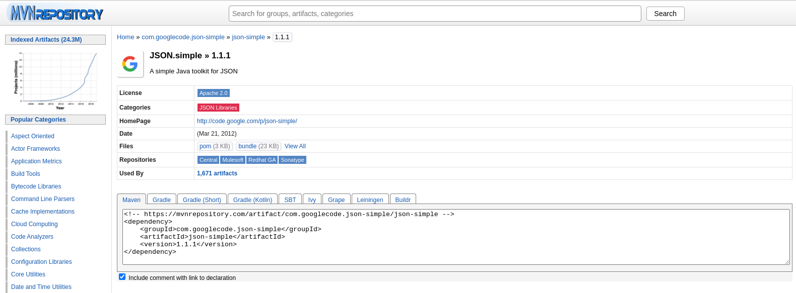
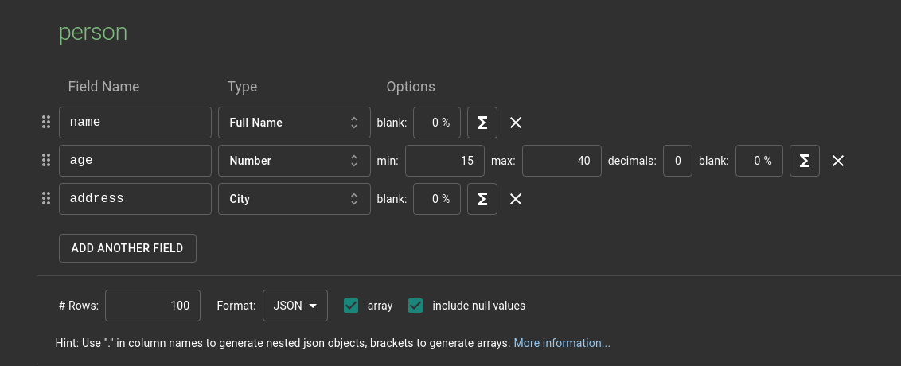

## Sử dụng JSON
JSON (JavaScript Object Notation) là một kiểu định dạng dữ liệu tuân theo một quy luật nhất định mà hầu hết các ngôn ngữ lập trình hiện nay đều đọc được.


```json
{
  "name": "Mariette O'Fogarty",
  "age": 33,
  "address": "Guamo"
}
```
Định dạng JSON sử dụng các cặp key – value để dữ liệu sử dụng. Nó hỗ trợ các cấu trúc dữ liệu như đối tượng và mảng

Sử dụng thư viện json-simple: https://code.google.com/archive/p/json-simple/downloads

Hoặc nếu quản lý project java bằng maven thì sử dụng mavenrepository  


Tạo dữ liệu mẫu
Tạo dữ liệu mẫu từ https https://www.mockaroo.com/, trả về file person.json có 100 bản ghi

