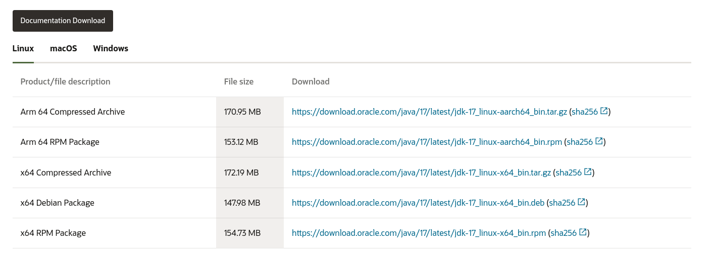
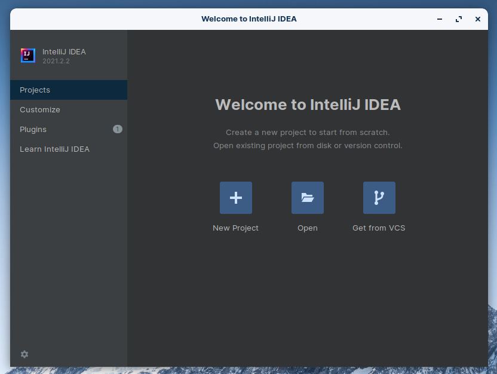
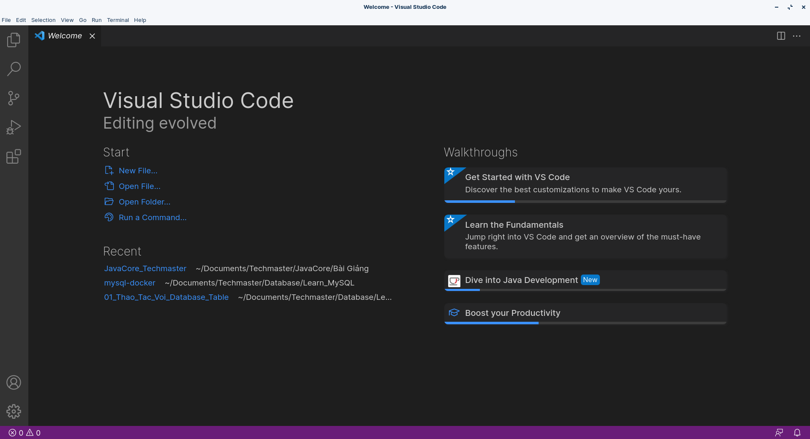

## Hướng dẫn cài đặt môi trường
Để lập trình java ta cần cài đặt:  

**1, JDK - Java Development Kit** là bộ phần mềm cung cấp môi trường phát triển ứng dụng viết bằng ngôn ngữ Java.   

Phiên bản JDK mới nhất hiện nay là JDK 17, hãy sử dụng phiên bản này  

Link download: [https://www.oracle.com/java/technologies/downloads/](https://www.oracle.com/java/technologies/downloads/)

**2, Công cụ lập trình Java**: có khá nhiều công cụ hỗ trợ lập trình Java có thể kể đến như: Eclipse, Netbean, IntelliJ IDEA, VS Code thậm chí bạn cũng có thể sử dụng note pad để lập trình java,...  
Ở đây, mình khuyên các bạn nên sử dụng IntelliJ IDEA hoặc VSCode.  
- Với IntelliJ IDEA sẽ có 2 phiên bản cho bạn sử dụng là Community (Bản miễn phí) và Ultimate (Bản có phí).(*Bạn hoàn toàn có thể sử dụng bản miễn phí, nhưng nếu có tiền thì hãy trải nghiệm bản Ultimate nhé vì nó có nhiều tính năng hơn so với bản Community*)    

  

- Với VS Code(Visual Studio Code) là một trong những trình soạn thảo được sử dụng bởi các lập trình viên và nó miễn phí. với tính năng hỗ trợ nhiều ngôn ngữ lập trình, nên VS Code càng được lòng các lập trình viên.  

Còn đối với mình, mình thích nhất VS Code ở việc giao diện thân thiện, dễ dàng tuỳ chỉnh và việc thêm chức năng, extension cũng dễ dàng  
*Lưu ý: Đừng nhầm vs code với visual studio*

Link cài đặt:
- IntelliJ IDEA: [https://www.jetbrains.com/idea/download/#section=linux](https://www.jetbrains.com/idea/download/#section=linux)  
- VS Code: [https://code.visualstudio.com/](https://code.visualstudio.com/)

Nhớ download phiên bản phù hợp với hệ điều hành mà bạn đang sử dụng   

***Video hướng dẫn download và cài đặt JDK và VS Code***: [https://www.youtube.com/watch?v=RrYAee6ZrTw&t=3s&ab_channel=TechMasterVietnam](https://www.youtube.com/watch?v=RrYAee6ZrTw&t=3s&ab_channel=TechMasterVietnam)