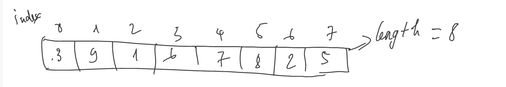
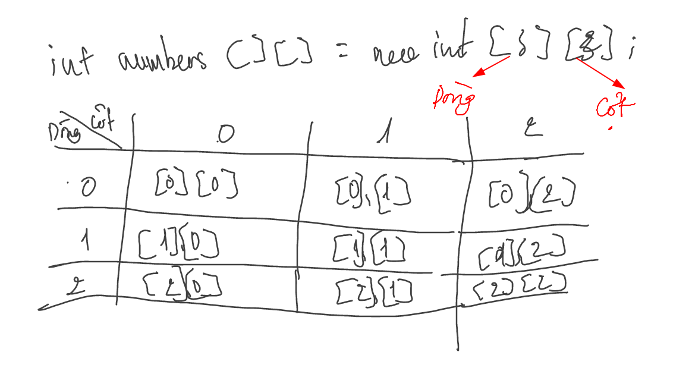

## Mảng trong java
Mảng là tập hợp các phần tử có cùng kiểu  dữ liệu được lưu gần nhau trong bộ nhớ.  
Mảng trong java được lưu theo chỉ số (index), phần tử đầu tiên có chỉ số là 0  

Mảng được chia thành 2 kiểu:
- Mảng 1 chiều  
- Mảng đa chiều

## Mảng một chiều


Ví dụ khai báo và cấp phát bộ nhớ mảng 
```java
//Mảng kiểu số nguyên
 //khai báo
int[] numbers;

//Cấp phát bộ nhớ
numbers = new int[5];

//Mảng chuỗi
String names [] = new String[5];
```


## Mảng đa chiều


```java
int [][] numbers = new int[3][2];
//Mangr này có số dòng là 3 và số cột là 2
```