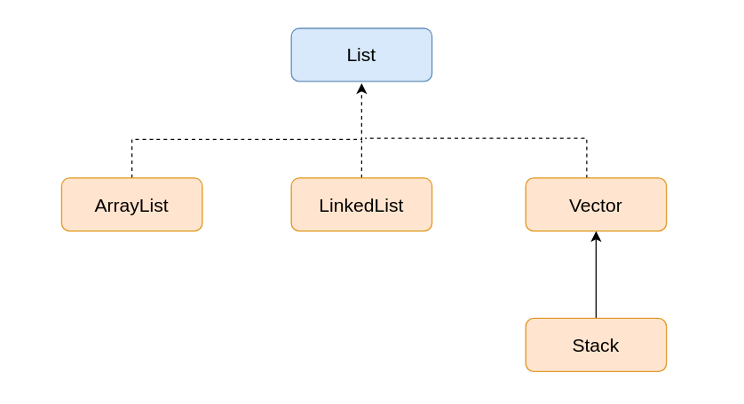
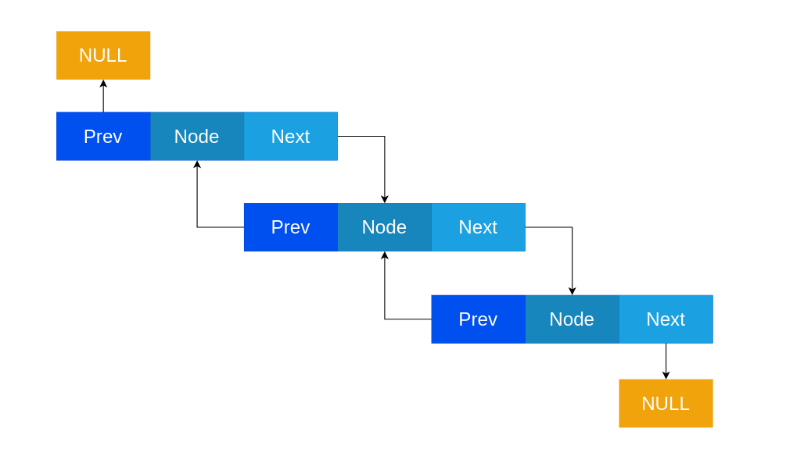

## Tất tần tật về Java Collections - List Interface (Phần 2)

List interface kế thừa Collection và cung cấp các phương thức để thao tác với các phần tử trong List  
- Các phần tử có thể được chèn hoặc truy cập từ vị trí của chúng trong danh sách. Danh sách lưu các phần tử theo chỉ số (index), chỉ số của phần tử đầu tiên là 0
- Trong List được phép chứa các phần tử trùng nhau    
- Ngoài các phương thức được định nghĩa bởi Collection, List còn định nghĩa một số phương thức riêng của nó, mình sẽ tóm tắt nó dưới đây:  

1 - `void add(int index, Object obj)`: Chèn đối tượng `obj` vào vị trí `index` trong List  
2 - `boolean addAll (int index, Collection c)`: Chèn toàn bộ phần tử của `c` vào vị trí `index` trong danh sách  
3 - `Object get(int index)`: Trả về đối tượng ở vị trí `index`   
4 - `int indexOf(Object obj)` : Trả về `index` của phần tử `obj` xuất hiện đầu tiên. Nếu `obj` không tồn tại trong danh sách thì trả về -1
5 - `int lastIndexOf(Object obj)`: Trả về `index` của phần tử `obj` xuất hiện cuối cùng. Nếu `obj` không tồn tại trong danh sách thì trả về -1  
6 - `ListInterator listIterator()`: Trả về một `iterator` mà bắt đầu từ phần tử đầu tiên của list  
7 - `ListInterator listIterator(int index)`: Trả về một `iterator` mà bắt đầu từ phần tử tại `index` được chỉ định  
8 - `Object remove(int index)`:  Lấy ra phần tử ở vị trí `index` và xóa phần tử đó
9 - `Object set(int index, Object obj)`: Thay đổi phần tử ở vị trí `index` bằng `obj`  
10 - `List subList(int start, int end)`: Trả về một list bao gồm các phần tử được bắt đầu từ start đến end được chỉ định trong 1 list đang gọi.  


Vì List là một interface nên không thể tiến hành tạo đối tượng từ List mà phải thông qua các class implements nó như ArrayList, LinkedList, Vector, Stack.  

  

## ArrayList  
  
ArrayList trong Java là một lớp kế thừa từ AbtractList và implements List interface trong collections framework nên nó có một vài đặc điểm và phương thức tương đồng với List. ArrayList được sử dụng như một mảng động để lưu trữ các phần tử.    
Mặc dù ArrayList có thể chậm hơn mảng nhưng lại hữu ích trong các chương trình càn nhiều thao tác như: thêm, sửa, xóa phần tử,...  
Để khởi tạo ArrayList, ta có cú pháp:  
```java
List<Kiểu dữ liệu> <Tên> = new ArrayList<>();
ArrayList<Kiểu dữ liệu> <Tên> = new ArrayList<>();
```
*Lưu ý: Kiểu dữ liệu không cho phép kiểu nguyên thủy*  

Ví dụ:  
```java  
List<Integer> listNumber = new ArrayList<Integer>();
List<String> listCity = new ArrayList<String>();
```

**Một số phương thức thường được sử dụng trong ArrayList**
| Method | Description | 
|---|---|
| boolean add(Collection c) | Thêm phần tử được chỉ định vào cuối danh sách | 
| void add(int index, Object element) | Chèn phần tử được chỉ định vào vị trí đã được chỉ định | 
| void clear()| Xóa tất cả phần tử trong danh sách | 
| int lastIndexOf(Object o)| Trả về index của phần tử `o` xuất hiện cuối cùng, nếu `o` không có trong danh sách trả về -1  | 
|  Object clone()| Tạo một ArrayList copy từ ArrayList ban đầu | 
|  Object[] toArray()| Trả về một mảng chứa toàn bộ phần tử của danh sách | 
|  void trimToSize()| Cắt giảm dung lượng của ArrayList thành kích thước hiện tại của danh sách | 

**Hãy cùng xem một số ví dụ dưới đây:**
```java
import java.util.ArrayList;
import java.util.Iterator;
import java.util.List;

public class App {
    public static void main(String[] args) throws Exception {
        List<String> listAnimal = new ArrayList<String>(); //Tạo ArrayList
        listAnimal.add("Dog");  //Thêm phần tử vào ArrayList
        listAnimal.add("Cat");
        listAnimal.add("Mouse");

        listAnimal.add(1, "Bear");

        System.out.println("Danh sách động vật: ");
        for(int i = 0; i < listAnimal.size(); i++){  //size() lấy kích thước ArrayList
            System.out.println(listAnimal.get(i));  //get(int index)  lấy ra phần tử ở vị trí index
        }

        //Sử dụng foreach
        System.out.println("Sử dụng foreach: ");
        for (String animal: listAnimal) {
            System.out.println(animal);
        }

        //Sử dụng Iterator
        System.out.println("Sử dụng iterator");
        Iterator<String> itr = listAnimal.iterator();
        while(itr.hasNext()){
            System.out.println(itr.next());
        }

    }
}
```


*Code tham khảo:* [https://github.com/EriChannel/JavaCore_Techmaster/tree/main/03_Advance_Topics/03_Collections/ListInterface/DemoArrayList](https://github.com/EriChannel/JavaCore_Techmaster/tree/main/03_Advance_Topics/03_Collections/ListInterface/DemoArrayList)


## LinkedList  
LinkedList trong Java là một lớp kế thừa lớp AbstractSequentialList và triển khai của List, Queue Interface trong Collections Framework nên nó sẽ có một vài đặc điểm và phương thức tương đồng với List, Queue.   
LinkedList có thể được sử dụng như list, stack, queue  
Trong Java, có 2 loại LinkedList được sử dụng để lưu trữ các phần tử:  
- Singly Linked List: Trong Singly Linked List, mỗi node trong danh sách này được lưu trữ dữ liệu của node và con trỏ trỏ tới node tiếp theo trong danh sách   


- Doubly Linked List: Trong Double Linked List, có hai tham chiếu, đến node tiếp theo và đến node trước đó.

  

Để khởi tạo LinkedList, sử dụng cú pháp:  
```Java
List<Kiểu dữ liệu> <Tên> = new LinkedList<>();
LinkedList<Kiểu dữ liệu> <Tên> = new LinkedList<>();
```

Ví dụ:

```java
List<Integer> numbers = new LinkedList<Integer>();
List<String> names = new LinkedList<String>();
```

**Một số phương thức thường được sử dụng trong LinkedList**
| Method | Description | 
|---|---|
|  boolean add( Object o) | Thêm phần tử được chỉ định vào cuối danh sách | 
|  boolean contains(Object o) | Trả về `true` nếu danh chứa phần tử được chỉ định và trả về `false` nếu ngược lại | 
| void add (int index, Object element) | Chèn phần tử đã được chỉ định vào vị trí `index` | 
| int size()| Trả về kích thước của LinkedList | 
| boolean remove(Object o)	| Loại bỏ phần tử được chỉ định trong danh sách |   
| int indexOf(Object element)	| Trả về index xuất hiện đầu tiên của phần tử được chỉ định, nếu trong danh sách không có phần tử đó trả về -1 | 
| int lastIndexOf(Object element)	| Trả về index xuất hiện cuối cùngcủa phần tử được chỉ định, nếu trong danh sách không có phần tử đó trả về -1 |   


**Ví dụ về LinkedList**
  

```java
import java.util.Iterator;
import java.util.LinkedList;
import java.util.List;

public class Main {

    public static void main(String[] args) {
	    List<String> names = new LinkedList<>(); //Khởi tạo LinkedList
        names.add("John");  //Thêm phần tử vào LinkedList
        names.add("Anna");
        names.add("Peter");
        names.add("Victor");

        names.add(2, "Emma"); //Thêm phần tử vào vị trí index được chỉ định

        //Kiểm tra phần tử Anna có trong LinkedList không
        System.out.println("names.contains(\"Anna\"): "  + names.contains("Anna"));

        System.out.println("names.size(): " + names.size()); //Lấy kích thước

        System.out.println("LinkedList: ");
        for (String name: names) {
            System.out.println(name);
        }

        System.out.println("Phần tử sẽ bị thay thế là: "+names.set(2, "Chris"));

        //Sử dụng Iterator
        System.out.println("Sử dụng iterator: ");
        Iterator<String> itr = names.iterator();
        while(itr.hasNext()){
            System.out.println(itr.next());
        }
    }

}
```

*Code tham khảo:* [https://github.com/EriChannel/JavaCore_Techmaster/tree/main/03_Advance_Topics/03_Collections/ListInterface/DemoLinkedList](https://github.com/EriChannel/JavaCore_Techmaster/tree/main/03_Advance_Topics/03_Collections/ListInterface/DemoLinkedList)

## Vector  
Vector tương tự như ArrayList, có thể chứa các phần tử trùng lặp và được truy cập thông qua index. Tuy nhiên Vector khác với ArrayList ở điểm nó được đồng bộ hóa còn ArrayList thì không. Cũng vì lý do này mà Vector ít được sử dụng hơn so với mảng do cơ chế đồng bộ hóa khiến hiệu xuất của nó kém hơn.  
Để khởi tạo Vector, sử dụng cú pháp sau:  
```java
List<Kiểu dữ liệu> <Tên> = new Vector<>();
Vector<Kiểu dữ liệu> <Tên> = new Vector<>();
```
**Một số phương thức thường được sử dụng trong Vector**  
| Method | Description | 
|---|---|
| boolean add( Object o) | Thêm phần tử được chỉ định vào cuối danh sách | 
| void clear() | Loại bỏ tất cả phần tử ra khỏi danh sách | 
| void add(int index, Object element) | Chèn phần tử đã được chỉ định vào vị trí `index` | 
| boolean remove(Object o) | Loại bỏ phần tử được chỉ định trong danh sách  | 
| boolean contains(Object element)	| Trả về `true` nếu danh chứa phần tử được chỉ định và trả về `false` nếu ngược lại |   
| int size()| Trả về kích thước của Vector | 
| int indexOf(Object element)	| Trả về index xuất hiện đầu tiên của phần tử được chỉ định, nếu trong danh sách không có phần tử đó trả về -1 | 
| int lastIndexOf(Object element)	| Trả về index xuất hiện cuối cùng của phần tử được chỉ định, nếu trong danh sách không có phần tử đó trả về -1 |   

**Ví dụ về Vector**
```java
import java.util.Iterator;
import java.util.List;
import java.util.Vector;

public class Main {

    public static void main(String[] args) {
        List<String> animal = new Vector<>();
        animal.add("Dog");  //Thêm phần tử vào vector
        animal.add("Cat");
        animal.add("Bear");
        animal.add("Cat");

        animal.add(1, "Fish"); //Thêm phần tử vào index được chỉ định

        System.out.println("Kích thước của vector: " + animal.size());
        System.out.println("animal.contains(\"Bear\"): "+animal.contains("Bear"));
        System.out.println("animal.indexOf(\"Cat\"): " +animal.indexOf("Cat"));
        System.out.println("animal.lastIndexOf(\"Cat\"): " + animal.lastIndexOf("Cat"));


        //Sử dụng foreach
        for (String str: animal) {
            System.out.println(str);
        }

        //Sử dụng iterator
        Iterator<String> itr = animal.iterator();
        while(itr.hasNext()){
            System.out.println(itr.next());
        }
    }
}
```
  


*Code tham khảo:*[https://github.com/EriChannel/JavaCore_Techmaster/tree/main/03_Advance_Topics/03_Collections/ListInterface/DemoVector](https://github.com/EriChannel/JavaCore_Techmaster/tree/main/03_Advance_Topics/03_Collections/ListInterface/DemoVector)    

Ngoài ra, collections framework trong Java có một class là Stack, cung cấp chức năng của cấu trúc dữ liệu stack. Class này kế thừa class Vector. Tuy nhiên, chúng ta không nên sử dụng nó. Thay vào đó, nên sử dụng class ArrayDeque (Mình sẽ giới thiệu trong các bài viết sau) để triển khai cấu trúc dữ liệu Stack trong Java