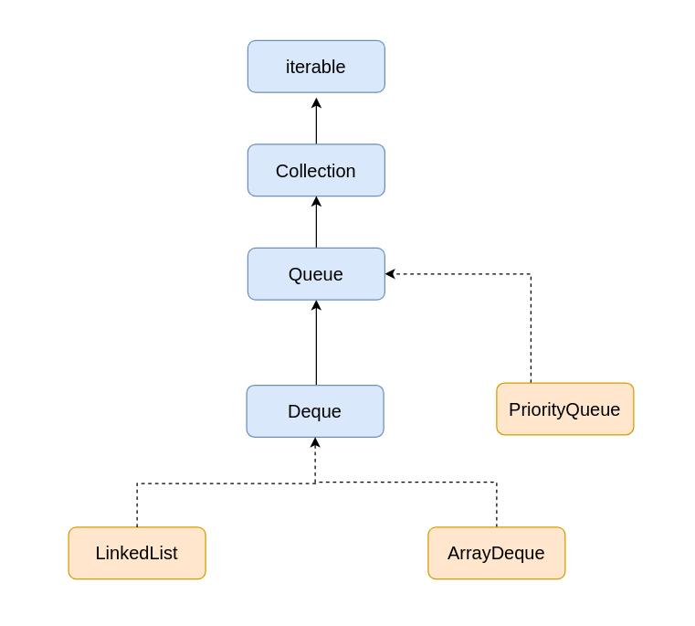
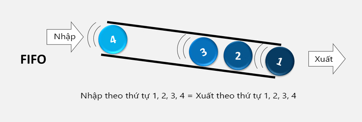

## Tất tần tật về Java Collections - Queue Interface (Phần 3)
</br>

  
</br>

Interface Queue nằm trong package `java.util` và kế thừa `Collection` interface. Nó được sử dụng để lưu trữ các phần tử được xử lý theo thứ tự FIFO (First In First Out).   
Trong FIFO, phần tử nào được thêm vào danh sách đầu tiên thì cũng sẽ bị gỡ khỏi danh sách đầu tiên (Vào trước ra trước).  
</br>

  
</br>

**Các phương thức trong Queue interface**  
- `boolean add(object)`: Thêm phần tử được chỉ định vào Queue. Nếu thêm thành công trả về `true`, ngược lại nó sẽ ném ra ngoại lệ  
- `boolean offer(object)`: Thêm phần tử được chỉ định vào Queue. Nếu thêm thành công trả về `true`, ngược lại trả về `false`  
- `Object remove()`: Trả về phần tử đầu tiên và xóa phần tử đó.Nếu queue trống sẽ ném ra ngoại lệ
- `Object poll()`: Trả về phần tử đầu tiên và xóa phần tử đó. Nếu queue trống sẽ trả về null
- `Object element()`: Trả về phần tử đầu tiên của queue. Nếu queue trống sẽ ném ra ngoại lệ
- `Object peek()`: Trả về phần tử đầu tiên của queue. Nếu queue trống sẽ trả về null  

</br>

**Đặc điểm của queue**
- Queue được sử dụng để thêm phần tử vào cuối danh sách và loại bỏ phần tử đầu tiên của danh sách. Nó tuân theo nguyên tắc FIFO  
- Queue hỗ trợ tất cả các phương thức của Collection interface bao gồm chèn, xóa,...
- LinkedList, ArrayBlockingQueue và PriorityQueue là những triển khai được sử dụng thường xuyên nhất  
- Nếu bất kỳ thao tác rỗng nào được thực hiện trên BlockingQueue, NullPoiterException sẽ được ném ra  
- Tất cả các Queue ngoại trừ Deque đều hỗ trợ thêm và loại bỏ phần tử ở cuối và đầu danh sách. Deque hỗ trợ thêm và loại bỏ phần tử ở cả hai đầu danh sách  

</br>

*Lưu ý*: Tương tự `List`, Queue là một interface do đó không thể tạo đối tượng từ queue mà phải thông qua các class implements nó như LinkedList, ArrayDeque, PriorityQueue.  

</br>

## LinkedList
Trong bài trước, chúng ta đã được sử dụng LinkedList để triển khai List interface. Tuy nhiên, LinkedList còn có thể được sử dụng như một queue. hãy xem cách tạo queue object bằng cách sử dụng class này.

```java
package vn.techmaster;
import java.util.LinkedList;
import java.util.Queue;

public class Main {
    public static void main(String[] args) {
	    //Khởi tạo LinkedList
        Queue<Integer> numbers = new LinkedList<>();

        //Thêm phần tử
        numbers.add(10);
        numbers.add(15);
        numbers.add(20);
        numbers.offer(25);

        System.out.println("Danh sách đầu tiên: ");
        for (Integer i: numbers) {
            System.out.print(i + "\t");
        }

        //Lấy phần tử đầu tiên
        System.out.println("\nPhần tử đầu tiên: " + numbers.peek());

        //Lấy ra phần tử đầu tiên và xóa phần tử đó
        System.out.println("Phần tử đầu tiên: " +numbers.poll());
        System.out.println("Danh sách sau khi xóa: ");
        for (Integer i: numbers) {
            System.out.print(i + "\t");
        }
    }
}
```

Kết quả nhận được:
```
Danh sách đầu tiên: 
10	15	20	25	
Phần tử đầu tiên: 10
Phần tử đầu tiên: 10
Danh sách sau khi xóa: 
15	20	25	
```

*Code tham khảo:* [https://github.com/EriChannel/JavaCore_Techmaster/tree/main/03_Advance_Topics/03_Collections/QueueInterface/DemoLinkedList](https://github.com/EriChannel/JavaCore_Techmaster/tree/main/03_Advance_Topics/03_Collections/QueueInterface/DemoLinkedList)

</br>

## PriorityQueue  

không giống các queue thông thường, PriorityQueue được sử lý theo mức dộ ưu tiên. Mặc dù các phần tử của PriorityQueue không được sắp xếp nhưng các phần tử luôn được lấy ra theo thứ tự sắp xếp.  
Cùng xem ví dụ dưới đây:  
  
```java
package vn.techmaster;
import java.util.PriorityQueue;
import java.util.Queue;

public class Main {

    public static void main(String[] args) {
	    Queue<Integer> numbers = new PriorityQueue<>();
        numbers.add(5);
        numbers.add(9);
        numbers.add(3);
        numbers.add(7);


        System.out.println("Danh sách ban đầu: ");
        for (Integer i: numbers) {
            System.out.print(i + "\t");
        }

        //Lấy ra phần tử đầu tiên và xóa phần tử đó:
        System.out.println("\nPhần tử đầu tiên: " + numbers.poll());
        System.out.println("Phần tử đầu tiên: " + numbers.poll());

        numbers.offer(1);
        System.out.println("\nDanh sách ban đầu: ");
        for (Integer i: numbers) {
            System.out.print(i + "\t");
        }
    }
}
```

Kết quả nhận được:
```
Danh sách ban đầu: 
3	7	5	9	
Phần tử đầu tiên: 3
Phần tử đầu tiên: 5

Danh sách ban đầu: 
1	9	7	
```

*Code tham khảo:*  [https://github.com/EriChannel/JavaCore_Techmaster/tree/main/03_Advance_Topics/03_Collections/QueueInterface/DemoPriorityQueue](https://github.com/EriChannel/JavaCore_Techmaster/tree/main/03_Advance_Topics/03_Collections/QueueInterface/DemoPriorityQueue)

Ở đây mình tạo một PriorityQueue có tên numbers. Mặc dù phần tử phần tử 5 được thêm vào trước phần tử 3 nhưng phần tử 3 lại là phần tử đầu tiên. Đó là do phần tử 3 là phần tử nhỏ nhất của queue    
Tiếp theo mình thêm phần tử 1 vào queue nhưng phần tử 1 lại trở thành phần tử đầu tiên mặc dù được thêm vào sau cùng  

</br>

## PriorityBlockingQueue  
Lưu ý rằng cả LinkedList và PriorityQueue đều không an toàn theo luồng. PriorityBlocking là một triển khai thay thế nếu cần triển khai luồng an toàn.  
Tương tự PriorityQueue, PriorityBlockingQueue là một lớp đại diện cho một queue với các phần tử được sắp xếp theo thứ tự ưu tiên. ĐIều khác biệt là nó implements BlockingQueue interface, vì vậy có thêm các tính năng được đặc tả bởi interface này. 

 ```java
 public class PriorityBlockingQueue<E> extends AbstractQueue<E>
    implements BlockingQueue<E>, java.io.Serializable
 ```

 hãy cùng xem ví dụ dưới đây:  
 ```java
 package vn.techmaster;

import java.util.Queue;
import java.util.concurrent.PriorityBlockingQueue;

public class Main {

    public static void main(String[] args) {
        Queue<Integer> numbers = new PriorityBlockingQueue<>();
        numbers.add(9);
        numbers.add(4);
        numbers.add(6);
        numbers.add(7);

        System.out.println("Danh sách ban đầu: ");
        System.out.println(numbers);

        System.out.println("\nPhần tử đầu tiên: " + numbers.poll());

        numbers.offer(1);
        System.out.println("Danh sách sau khi thêm: ");
        System.out.println(numbers);

        System.out.println("Phần tử đầu tiên : " +numbers.peek());
    }
}
```

Kết quả trả về:  
```
Danh sách ban đầu: 
[4, 7, 6, 9]

Phần tử đầu tiên: 4
Danh sách sau khi thêm: 
[1, 6, 9, 7]
Phần tử đầu tiên : 1
```  

*Code tham khảo:* [https://github.com/EriChannel/JavaCore_Techmaster/tree/main/03_Advance_Topics/03_Collections/QueueInterface/DemoPriorityBlockingQueue](https://github.com/EriChannel/JavaCore_Techmaster/tree/main/03_Advance_Topics/03_Collections/QueueInterface/DemoPriorityBlockingQueue)

Có thể thấy, tương tự như PriorityQueue, PriorityBlockingQueue cũng sắp xếp phần tử theo thứ tự ưu tiên.  

Ngoài ra, chúng ta còn ArrayDeque, tuy nhiên chúng ta sẽ cùng tìm hiểu trong bài viết khác để làm rõ về Deque và ArrayDeque.