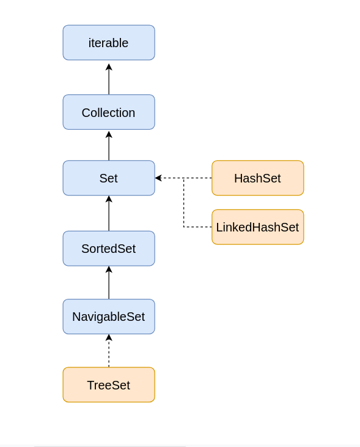

## Tất tần tật về Java Collections - Set Interface (Phần 4)

## Set interface là gì?

Set interface nằm trong package `java.util` và kế thừa Collection interface. Khác với Queue và List, Set không cho phép lưu trữ các phần tử trùng lặp. Set interface chứa các phương thức kế thừa từ Collection interface và thêm một tính năng hạn chế việc chèn các phần tử trùng lặp.  
Có hai interface kế thừa và triển khai Set interface là SortedSet và NavigableSet  
</br> 



</br> 

**Các phương thức trong set interface:**  
- `add(element)`: Thêm phần tử được chỉ định vào collection đó. Nếu thất bại trả về `false`
- `addAll(collection)`: Thêm tất cả các phần tử trong một collection được chỉ định vào collection hiện có
- `clear()`: Xóa tất cả các phần tử ra khỏi collection nhưng không xóa set. Tham chiếu cho set vẫn tồn tại
- `contains(element)`: Kiểm tra xem phần tử được chỉ định có tồn tại trong set không, nếu có trả về `true`
- `containsAll(collection)`: Kiểm tra xem collection được chỉ định có nằm trong collection hiện tại không. Nếu có trả về `true`.
- `hashCode()`: Trả về hashcode (mã băm) của collection
- `isEmpty()`: Kiểm tra xem trong set có phần tử nào không. Nếu không có phần tử nào trả về `true`
- `iterator()`: Trả về một đối tượng iterator cho collection mà có thể được sử dụng để thu nhận một đối tượng
- `remove(element)`: Loại bỏ phần tử được chỉ định ra khỏi collection
- `removeAll(collection)`: Loại bỏ tất cả các phần tử của collection được chỉ định ra khỏi collection hiện tại
- `retainAll(collection)`: Sử dụng để giữa lại các phần tử nằm trong collection được chỉ định 
- `size()`: Trả về số phần tử trong collection
- `toArray()`: Dùng để tạo một mảng gồm các phần tử giống với set

</br>

## Triển khai Set interface
Do Set là một interface nên không thể tạo đối tượng từ Set mà phải thông qua các class kế thừa nó.

### Class HashSet
HashSet là một trong nhưng class được sử dụng rộng rãi nhất trong Set interface. HashSet được dùng để tạo collection sử dụng hash table (bảng băm) để lưu trữ. 
Một hash table lưu trữ thông tin bởi sử dụng một kỹ thuật được gọi là hasing (băm). Trong hashing, nội dung mang tính thông tin của một key được sử dụng để quyết định một value duy nhất, được gọi là hash code. Hash code được sử dụng như index, tại đó dữ liệu mà liên kết với key được lưu giữ.  
Lưu ý: HashSet cho phép thêm phần tử `NULL`  

Hãy cùng xem ví dụ dưới đây:  
```java
package vn.techmaster;

import java.util.HashSet;
import java.util.Set;

public class Main {
    public static void main(String[] args) {
        //Khởi tạo Set có kiểu là Integer
        Set<Integer> set = new HashSet<>();
        //Thêm phần tử vào set
        set.add(5);
        set.add(1);
        set.add(7);
        set.add(3);

        System.out.println(set);

        //Thêm phần tử trùng lặp
        set.add(3);
        System.out.println(set);

        //Xóa phần tử 7
        set.remove(7);
        System.out.println("Set sau khi loại bỏ phần tử: " + set);
    }
}
```

Kết quả trả về: 
```
[1, 3, 5, 7]
[1, 3, 5, 7]
Set sau khi loại bỏ phần tử: [1, 3, 5]
```

Có thể thấy, khi thêm phần tử vào Set, thứ tự các phần tử không được giữ nguyên mà được sắp xếp theo thứ tự tăng dần.  
Tiến hành thêm phần tử trùng lặp thì phần tử đó sẽ không được thêm vào Set.  

<br/>

### Class EnumSet

EnumSet được triển khai trong collection framework, là một trong những triển khai chuyên biệt của Set interface sử dụng với kiểu enum.   
Ví dụ:  
```java
ackage vn.techmaster;

import java.util.EnumSet;
import java.util.Set;

public class Main {
    enum Days{
        SUNDAY, MONDAY, TUESDAY, WEDNESDAY, THURSDAY, FRIDAY, SATURDAY
    }

    public static void main(String[] args) {
        Set<Days> set1 = EnumSet.of(Days.MONDAY, Days.TUESDAY);
        System.out.println(set1);

        Set<Days> set2 = EnumSet.allOf(Days.class);
        System.out.println(set2);

        Set<Days> set3 = EnumSet.noneOf(Days.class);
    }
}
```

Kết quả nhận được:
```
[MONDAY, TUESDAY]
[SUNDAY, MONDAY, TUESDAY, WEDNESDAY, THURSDAY, FRIDAY, SATURDAY]
```

<br/>  

### Class LinkedHashSet
Lớp LinkedHashSet được triển khai trong collection framework. Nó kế thừa HashSet và triển khai Set interface. Nhưng khác với HashSet, LinkedHashSet đảm bảo thứ tự khi phần tử được thêm vào   
Ví dụ:  
```java
package vn.techmaster;

import java.util.LinkedHashSet;
import java.util.Set;

public class Main {
    public static void main(String[] args) {
        //Khởi tạo LinkedHashSet
        Set<Integer> set = new LinkedHashSet<>();
        //Thêm phần tử vào set
        set.add(5);
        set.add(1);
        set.add(7);
        set.add(9);

        System.out.println(set);

        set.add(7);  //Thêm phần tử trùng lặp
        System.out.println(set);

        set.remove(7); //Loại bỏ phần tử
        System.out.println(set);
    }
}
```

Kết quả nhận được:  
```
[5, 1, 7, 9]
[5, 1, 7, 9]
[5, 1, 9]
``` 

Vậy có thể thấy đối với LinkedHashSet, khi các phần tử được thêm vào thì thứ tự sẽ không bị thay đổi. Việc thêm phần tử trùng lặp cũng không sảy ra trong LinkedHashSet  

<br/>  

### Class TreeSet  
Lớp TreeSet là một phần của collection framework. Nó implements từ Navigable interface và kế thừa từ SortedSet.  
Lớp TreeSet sử dụng TreeMap để lưu trữ các phần tử. Các phần tử trong TreeSet được sắp xếp theo thứ tự tăng dần, nhưng chúng ta có thể thay đổi cách sắp xếp theo thứ tự giảm dần bằng phương thức `TreeSet.descendingSet()`.   
Hãy xem ví dụ dưới đây:  
```java
package vn.techmaster;

import java.util.TreeSet;

public class Main {

    public static void main(String[] args) {
        //Khởi tạo TreeSet
        TreeSet<Integer> set = new TreeSet<>();
        //Thêm phần tử vào set
        set.add(5);
        set.add(1);
        set.add(7);
        set.add(3);

        System.out.println(set);

        set.add(3);//Thêm phần tử trùng lặp
        System.out.println(set);

        //Xóa phần tử
        set.remove(7);
        System.out.println(set);
        System.out.println("Sắp xếp theo thứ tự giảm dần: " + set.descendingSet());
    }
}
```

Kết quả trả về:  
```
[1, 3, 5, 7]
[1, 3, 5, 7]
[1, 3, 5]
Sắp xếp theo thứ tự giảm dần: [5, 3, 1]
```

*Code tham khảo:* [https://github.com/EriChannel/JavaCore_Techmaster/tree/main/03_Advance_Topics/03_Collections/SetInterface](https://github.com/EriChannel/JavaCore_Techmaster/tree/main/03_Advance_Topics/03_Collections/SetInterface)